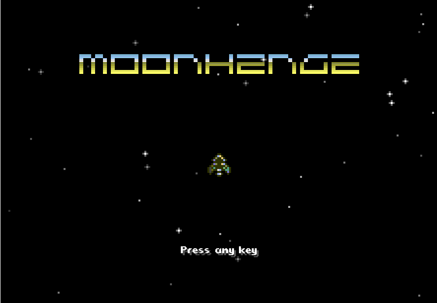

[Play it.](https://retrogradeorbit.github.io/moonhenge/)

# moonhenge

Global Game Jam 2016 entry.

Written in 24 hours with ClojureScript using the InfiniteLives game jam library.

## Instructions

Destroy wave after wave of enemy ship with ritualistic blasting to
collect the space-runes. Collecting all three runes results in the
opening of the space portal which will take you to moonhenge, where
the ancient astro-druids are meeting for the final ritual at the end
of the universe. You see the moonhenge for the gathering of the space
druids, oh yes.

 - Left/right cursor keys to steer.
 - Up arrow to thrust.
 - Z or Space to shoot.

## Global Game Jam Page

http://globalgamejam.org/2016/games/moonhenge

## License

Copyright © 2016 Crispin Wellington & Chris McCormick.

Distributed under the Eclipse Public License either version 1.0 or (at your option) any later version.
